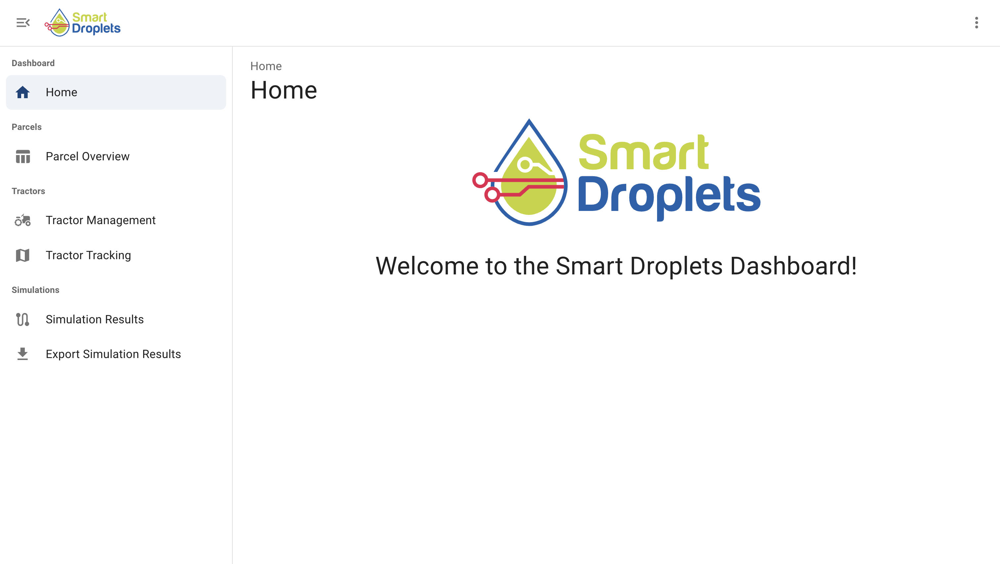
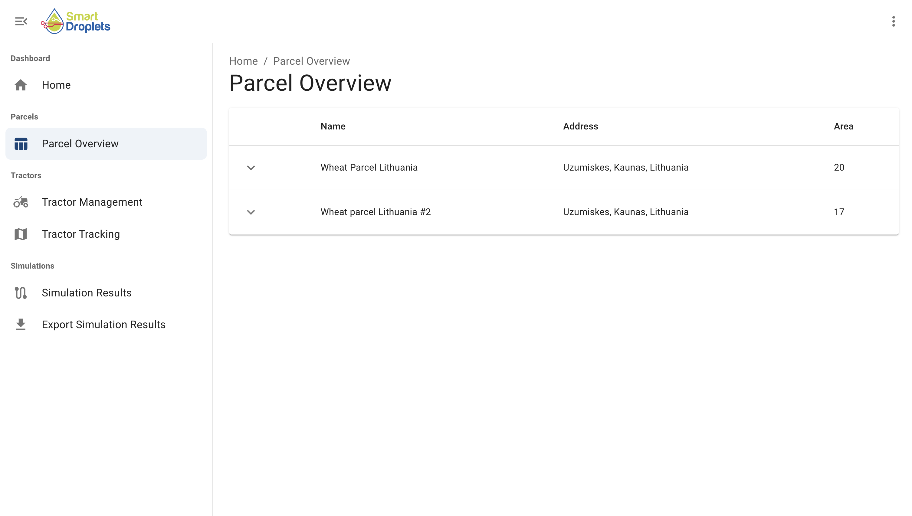

# SD Dashboard

The SD Dashboard provides a graphical interface for farmers and stakeholders to view analytics, monitor field conditions, and trigger manual simulation runs. Farmers can also trigger manual simulations by entering additional data.

## Overview

This web application is built with Next.js and interfaces with FIWARE components, specifically:
- Orion Context Broker - for real-time context information management
- QuantumLeap - for historical data storage and temporal queries

## Features

- Real-time monitoring of farm field conditions
- Manually triggering simulations
- Interactive dashboards for farm entity management
- Data input interface for custom simulation parameters
- Data export

## Screenshots


*Homepage of the dashboard*


*A list of all available parcels*


*Parcels map view*

## Getting Started

### Prerequisites

- Node.js 18.x or later
- npm or yarn
- Access to Orion Context Broker instance
- Access to QuantumLeap instance

### Installation

1. Clone the repository:
```bash
git clone https://github.com/your-username/sd-dashboard.git
cd sd-dashboard
```

2. Install dependencies:
```bash
npm install
# or
yarn install
```

3. (Optional) Configure local variables in .env.local in order to run locally.

4. Run the development server:
```bash
npm run dev
# or
yarn dev
```

5. Open http://localhost:3000 to view the dashboard.

## API Integration

The dashboard integrates with:

- Orion Context Broker for:

  - Real-time entity updates

  - Entity creation and management

- QuantumLeap for:

  - Querying time-series data

  - Presenting data in charts

## License

Copyright 2024 VizLore Labs Foundation

Licensed under the Apache License, Version 2.0 (the "License"); you may not use this file except in compliance with the License. You may obtain a copy of the License at

http://www.apache.org/licenses/LICENSE-2.0

Unless required by applicable law or agreed to in writing, software distributed under the License is distributed on an "AS IS" BASIS, WITHOUT WARRANTIES OR CONDITIONS OF ANY KIND, either express or implied. See the License for the specific language governing permissions and limitations under the License.